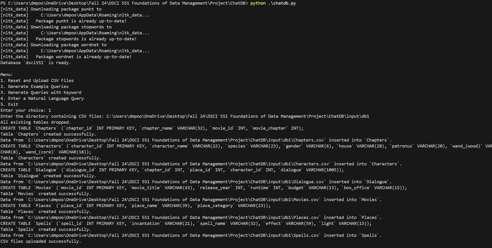
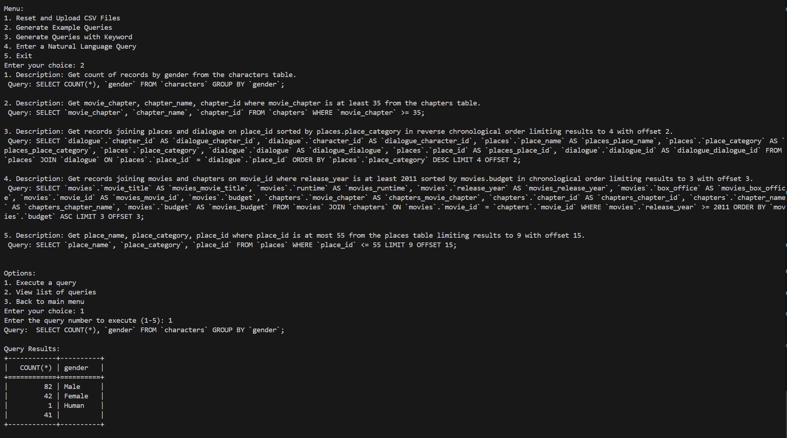
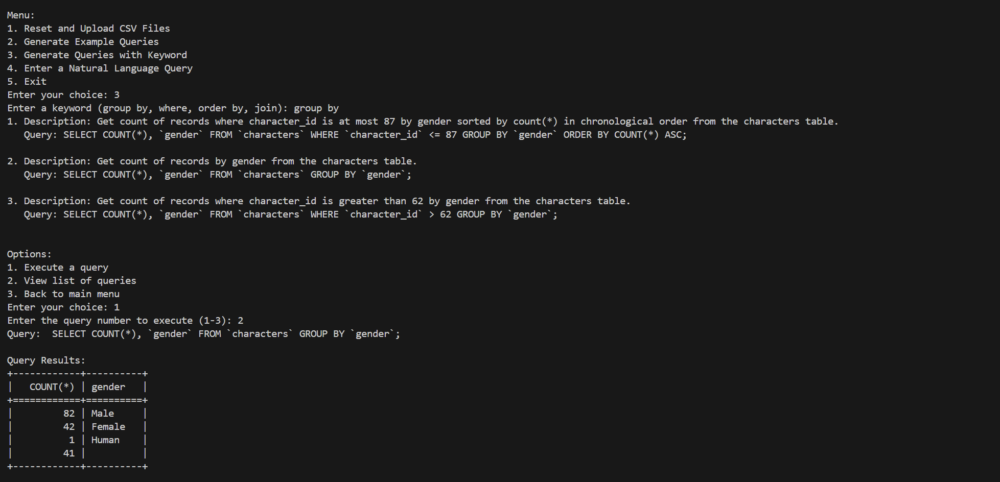
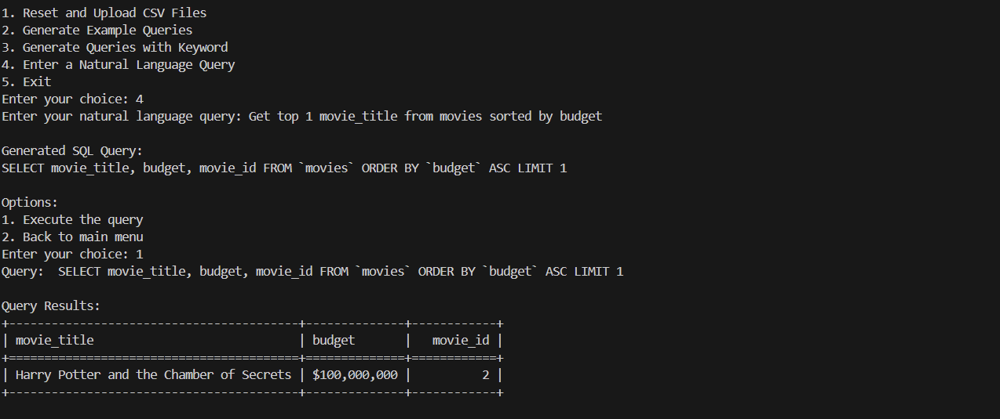

# ChatDB Application

## Overview

ChatDB is designed to assist users in learning how to query data in database systems, for MySQL. ChatDB not only suggests sample queries and interprets natural language queries but also executes these queries on database systems and displays the results.

## Key Features

- **Sample Query Suggestions**: Provides sample queries, including advanced constructs such as `GROUP BY` in SQL.
- **Natural Language Querying**: Understands and interprets natural language queries to generate database queries.
- **Query Execution**: Executes user-generated or suggested queries directly on the database and displays results.
- **Dataset Upload**: Allows users to upload datasets into the database system for querying.
- **Support for SQL and NoSQL Databases**: Compatible with MySQL, MongoDB, and other database systems.

## Supported Datasets

The application supports the following datasets:


1. [Harry Potter Movies Dataset as (db1)](https://www.kaggle.com/datasets/maricinnamon/harry-potter-movies-dataset)
2. [Target Dataset as (db2)](https://www.kaggle.com/datasets/devarajv88/target-dataset)
3. [Formula 1 Status Dataset as (db3)](https://www.kaggle.com/datasets/cbhavik/formula-1-ml-classifier?select=status.csv)

These datasets are stored in the database system as tables (e.g., in MySQL) or collections (e.g., in MongoDB).

## Getting Started

### Prerequisites

- Python 3.8+
- Required database systems (e.g., MySQL, MongoDB)
- Required Python libraries (listed in `requirements.txt`)

### Installation

1. Clone the repository:
   ```
   git clone https://github.com/HarshitaDPoojary/ChatDB.git
   cd ChatDB
   ```


2. Install dependencies
   ```
   pip install -r requirements.txt
   ```

3. Set up the required databases ( MySQL) and ensure the datasets are ready for upload.

### Running the Application
To run ChatDB, execute the following command:
```
python chatdb.py
```

Executing the script will give the following options:
```
1. Reset and Upload CSV Files
2. Generate Example Queries
3. Generate Queries with Keyword
4. Enter a Natural Language Query
5. Exit
```

1. Reset and Upload CSV Files
    It will prompt you to enter the path with 
    `Enter the directory containing CSV files: `
    You can provide the path to the dataset. 

    Example:
    


2. Generate Example Queries
    This will give some list of examples with `Description` and `Query`.
    Additionally after providing the queries, the gollowing options will be visible:
    ```
    1. Execute a query
    2. View list of queries
    3. Back to main menu
    ```
    - Execute the query: You can execute one of the quries given in the examples
    - View list of queries: You can see the list of queries again

    Example:
    


3. Generate Queries with Keyword
    The allowed keywords are: group by, where, order by, join
    This will give some list of examples with `Description` and `Query` having the keyword.
    Additionally after providing the queries, the gollowing options will be visible:
    ```
    1. Execute a query
    2. View list of queries
    3. Back to main menu
    ```
    a. Execute the query: You can execute one of the quries given in the examples
    b. view list of queries: You can see the list of queries again

    Example:
    


4. Enter a Natural Language Query
    Users can enter their query
    Sample keywrods for the users
    - Operators:
        `less than, at most, less than or equal, greater than, more than, at least, greater than or equal to, equal, equal to, is equal, is not equal to, not equal to`
    - Aggregators:
        `total/sum: SUM, average/mean: AVG, maximum/max: MAX, minimum/min: MIN, count/number of: COUNT`
    - Join Query: 
        `join, combine, merge , along with`
    - Group Query: 
        `grouped, group`
    - limit/offset:
        `top, first, last , skip , offset, after,`
    - sort:
        `order, ordered, sort, sorted, ascending, descending, asc, desc`
    
    Example:
    


